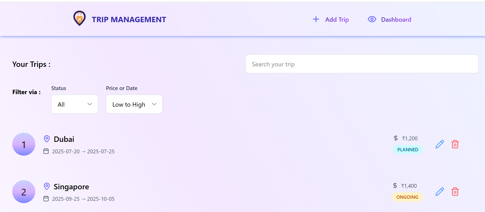
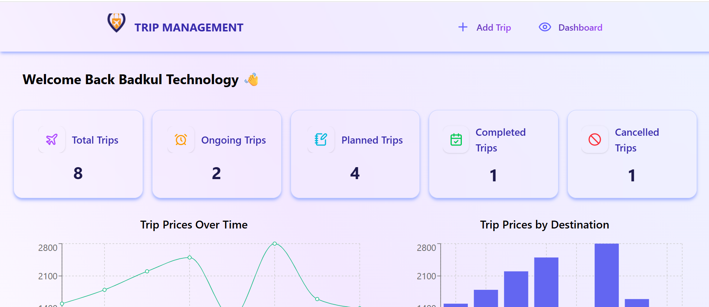
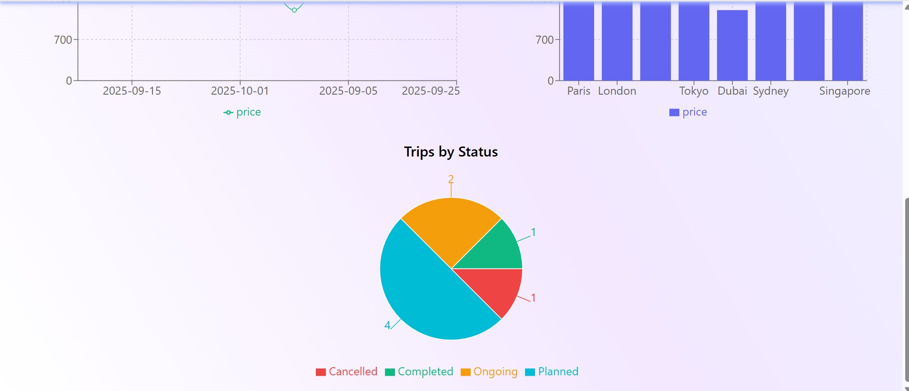
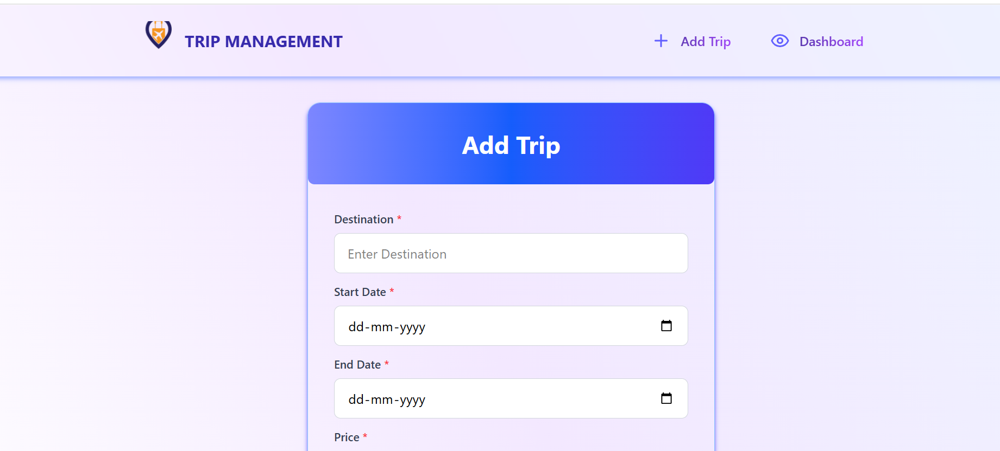
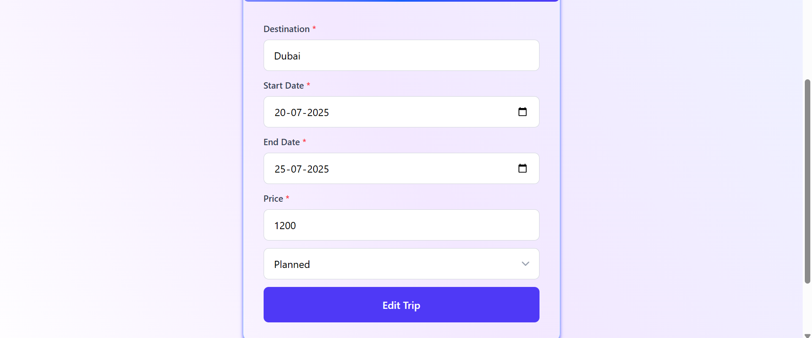

# Trip Management Application

This project is a React-based trip management application that allows users to view, add, edit, and delete trip information. It utilizes Redux for state management, React Router for navigation, and Tailwind CSS for styling.

# Site link

https://tripmanagementsystem.onrender.com

## Features

- **Dashboard:** Displays trip statistics and graphs, providing an overview of trip data.
- **Add Trip:** Allows users to add new trip information.
- **Edit Trip:** Enables users to modify existing trip details.
- **View Trips:** Presents a list of trips with search and filter options.
- **Search and Filter:** Provides functionality to search and filter trips based on destination and status.
- **Form Validation:** Implements form validation to ensure data accuracy.
- **Responsive Design:** Designed to be responsive and accessible on various devices.







## Technologies Used

- React
- Redux Toolkit
- React Router
- Tailwind CSS
- Recharts
- Lucide React Icons
- Vite

## Project Structure

- **`.gitignore`**: Specifies intentionally untracked files that Git should ignore.
- **`README.md`**: Provides an overview of the project.
- **`eslint.config.js`**: Configuration file for ESLint, a JavaScript linting tool.
- **`index.html`**: The main HTML file.
- **`package.json`**: Defines project dependencies and scripts.
- **`public/logo.png`**: Contains the project logo.
- **`src/App.jsx`**: Sets up the main application structure and routing using `react-router-dom`.
- **`src/components`**: Contains reusable components.
  - **`Card.jsx`**: Displays individual trip details.
  - **`Dropdown.jsx`**: A custom dropdown component used for filtering and sorting.
  - **`GraphTripsByPrice.jsx`**, **`GraphTripsByStatus.jsx`**, **`GraphTripsOverTime.jsx`**: Components for rendering charts using `recharts`.
  - **`Input.jsx`**: A reusable input component with validation and styling.
  - **`Navbar.jsx`**: Navigation bar with links to add trip and dashboard pages.
  - **`NavButton.jsx`**: Reusable button component used in the Navbar.
  - **`SearchFilterBar.jsx`**: Component for searching, filtering, and sorting trips.
  - **`StatCard.jsx`**: Displays statistical data on the dashboard.
  - **`TripForm.jsx`**: Reusable form for adding and editing trip details.
  - **`Welcome.jsx`**: Welcome message component.
- **`src/data/data.js`**: Contains initial dummy trip data.
- **`src/index.css`**: Main CSS file that imports tailwind styles.
- **`src/main.jsx`**: Entry point of the React application.
- **`src/pages`**: Contains page-level components.
  - **`AddTrip.jsx`**: Page for adding new trips.
  - **`Dashboard.jsx`**: Displays trip statistics and graphs.
  - **`EditTrip.jsx`**: Page for editing existing trips.
  - **`Home.jsx`**: Displays a list of trips with search and filter options.
- **`src/redux/store.js`**: Configures the Redux store.
- **`src/slices/tripSlice.js`**: Defines the Redux slice for managing trip data, including reducers for adding, setting, editing, and deleting trips. It also uses `localStorage` to persist the data.
- **`vite.config.js`**: Configuration file for Vite, the build tool.

## Getting Started

1.  Clone the repository:

    ```bash
    git clone https://github.com/ashifpathan21/React-Trip-Management-SEP-2025-BT-REACT-OCT-2025-372.git
    ```

2.  Install dependencies:

    ```bash
    npm install
    ```

3.  Start the development server:

    ```bash
    npm run dev
    ```

## Potential Improvements

- **Error Handling:** Implement more robust error handling, especially for API calls (if the application were to use an external API).
- **Testing:** Add unit and integration tests to ensure code quality and prevent regressions.
- **API Integration:** Connect the application to a backend API to persist data and enable collaboration.
- **Authentication:** Implement user authentication to secure trip data.
- **Validation:** Implement better form validation and error messages.
- **Responsiveness:** Ensure the application is fully responsive across different screen sizes.
- **Accessibility:** Improve accessibility for users with disabilities.
- **Date Handling:** Use a dedicated date library like Moment.js or date-fns for more robust date manipulation and formatting.
- **UI Enhancements:** Consider adding more advanced UI features, such as drag-and-drop sorting or more interactive charts.
- **Code Splitting:** Implement code splitting to improve initial load time.
- **Typescript:** Consider migrating the project to Typescript.
